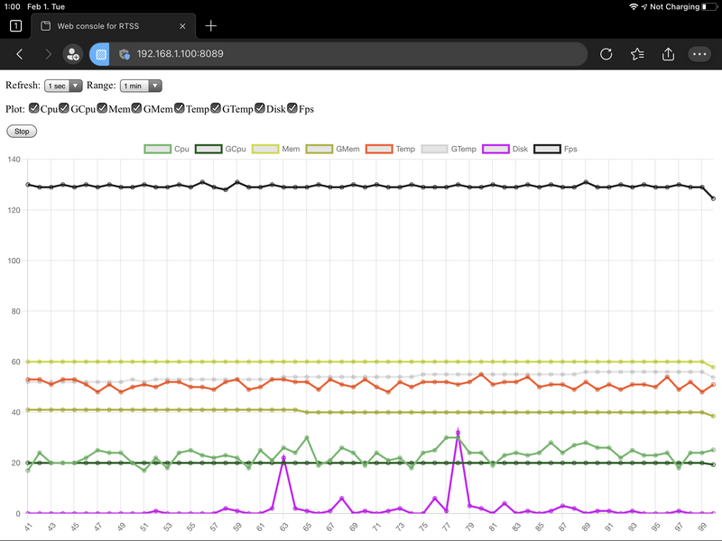
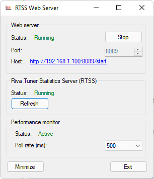

# Web server for RTSS (RTSSWS)
## Introduction
RTSSWS is a small utility to provide diagnostics data from computer (and 3D based application) performance to web browser. It can be used to remotely view system metric during a resource critical application (game, music production, etc.)

## Usage
You can download the app binray (zip) from [releases page](https://github.com/voji/rtssws/releases)...

This app required administrative rights, and .Net runtime 4.2 or higher. 

Additionaly if you would like to measure 3D application render performance (FPS), you need to install (and run)  **Guru 3D Riva Tuner Statistics Server** software. You can download it from [here](https://www.guru3d.com/files-details/rtss-rivatuner-statistics-server-download.html). 

## Screenshots

## Measurement
The polling rate defines the measurement frequency. When you use extreme high measure rate (like 10ms), the polling of values can cause significant load of your system.

The app measure the worst values, and gather them during 1s time window. 

- CPU - max load (per core)
- TEMP - highest temp value
- DISK - max load (per disk)
- FPS - lowest FPS

So if do you have 6 core, and one of them peak 97%  load during the measurement, the result is 97% cpu load during the 1 second time window. It isn't a bug, it's a feature. 

With these data, you can identify bottlenecks, or not wanted behaviours (lack of resources, high temperatures, etc.). 
If you would like to make a more sophisticated analysis what's happend, you can use more  sophisticated tools, like [Windows Performance Analyser](https://www.microsoft.com/en-us/p/windows-performance-analyzer/9n0w1b2bxgnz).

## Remote access
If you can't access the application page from another computer, try to enable incoming connections the given port on Windows Firewall settings (Windows Defender Firewall - Advanced Settings - Inbound Rules - New Rule... - Port - TCP - 8089 (or what you defined) - Allow the connection).  

## Bugs
You can report bugs, or add suggestions on [project page](https://github.com/voji/rtssws/issues)

## Thanks
- [Chart.js](https://www.chartjs.org/)
- [LibreHardwareMonitor project](https://github.com/LibreHardwareMonitor/LibreHardwareMonitor)
- [RTSSSharedMemoryNET](https://github.com/spencerhakim/RTSSSharedMemoryNET)
